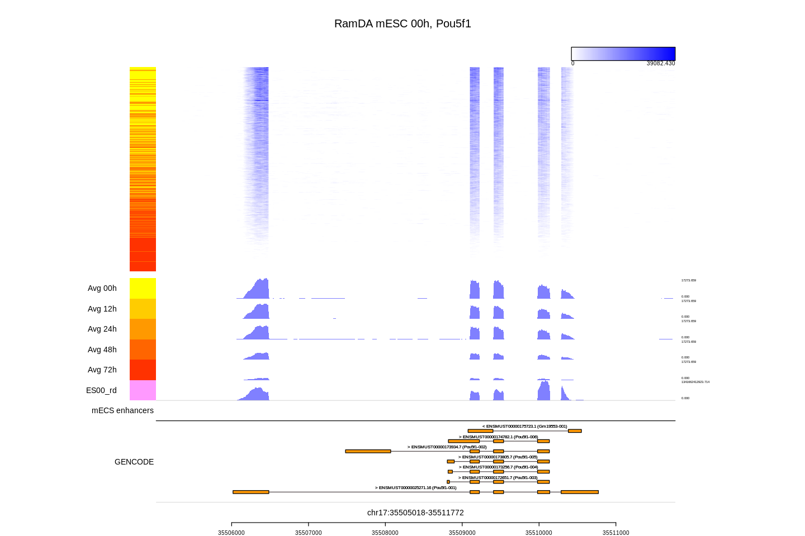

#  Millefy


Millefy provides genome browser-like visualization of single-cell RNA sequensing (scRNA-seq) datasets.

Millefy is available as an R package and [a Docker image with JupyterLab](https://github.com/yuifu/datascience-notebook-millefy).

## Example of millefy plot




## Getting started
### Installation

```
devtools::install_github("yuifu/millefy")
```

#### Requirements

- R (version 3.2.2 or higher)

#### Dependency

- Rsamtools
- GenomicRanges
- data.table
- dplyr
- magrittr
- grid
- destiny
- rtracklayer
- IRanges
- tidyr

### Quick example

```
# Path to bigWig files
bwfiles = Sys.glob(file.path(system.file("extdata", package="millefy"), "*.bw"))

# Group labels for bigWig files (same length as \\code{bwfiles})
groups = c("00h", "00h", "00h", "12h", "12h", "12h")

# Color labels for bigWig files (A named vector with the same length as the number of kinds of \\code{groups})
color_labels <- colorRampPalette(c("yellow", "red"))(length(unique(groups))+1)[1:length(unique(groups))]
names(color_labels)  <- unique(groups)

# Parameters
max_value = 7873

# Single cell track
scTrackBw <- list(path_bam_files = bwfiles, groups = groups, group_colors = color_labels, max_value = max_value, isBw=TRUE)

# Gene annotation track (For faster performance, try to use \\code{dt_gtf} paramter)
path_gtf = system.file("extdata", "example.gtf", package="millefy")
dt_gtf_exon <- gtfToDtExon(path_gtf)
geneTrack1 <- list(path_gtf = path_gtf, dt_gtf = dt_gtf_exon, label = "GENCODE")

# Prepare arguments for \\code{millefyPlot()}
tdlist <- list(scTrackBw, geneTrack1)
tt <- c("sc", "gene")
heights = c(12, 2)
text_main = "My plot"

# Location to visualize
chr =  "chr19" # character
start = 5824708 # integer
end = 5845478 # integer

```


When we don't set the `sc_sort_destiny` parameter (default), the order of single cells is the order of `bwfiles`.

```
# Plot
l <- millefyPlot(track_data=tdlist, track_type=tt, heights=heights,
          sc_type = "heatmap",
          chr = chr, start = start, end = end,
          sc_avg = TRUE, sc_avg_height = 1,
          title = text_main)
```


When we set `sc_sort_destiny = 'all'`, all single cells are reordered by diffusion maps.

```
# Replot
invisible(
  millefyPlot(
        track_data=l$track_data, track_type=l$track_type, heights=l$heights,
        sc_type = "heatmap",
        chr = chr, start = start, end = end,
        sc_avg = TRUE, sc_avg_height = 1,
        title = text_main, sc_avg_scale = 10, sc_sort_destiny = 'all'
        )
)
```


When we set `sc_sort_destiny = 'group'`, all single cells in each group are reordered by diffusion maps.


```
# Replot
invisible(
  millefyPlot(
        track_data=l$track_data, track_type=l$track_type, heights=l$heights,
        sc_type = "heatmap",
        chr = chr, start = start, end = end,
        sc_avg = TRUE, sc_avg_height = 1,
        title = text_main,
        sc_avg_scale = 10, sc_sort_destiny = 'group'
        )
)
```


## Learning more
See [Tutorial](tutorial/Tutorial.md) for details.

