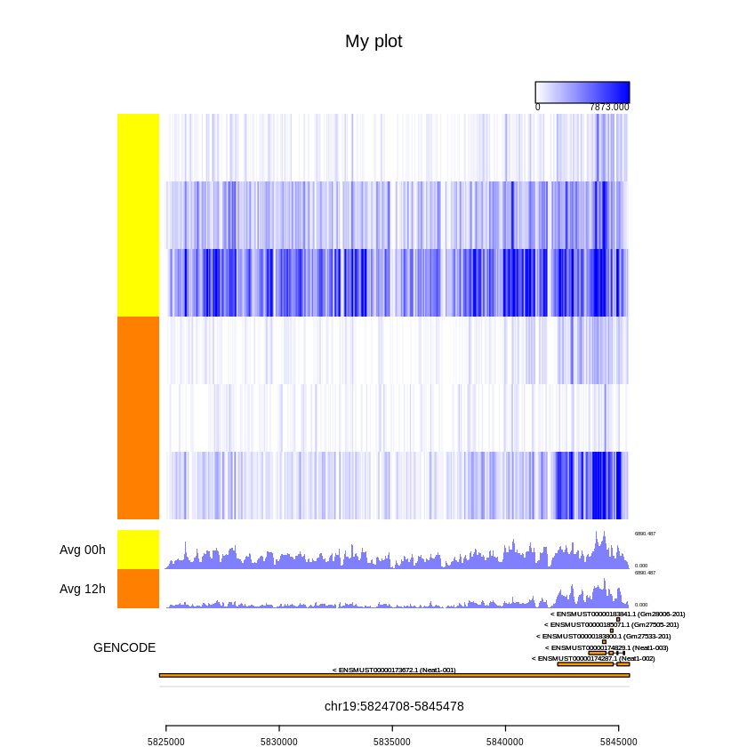
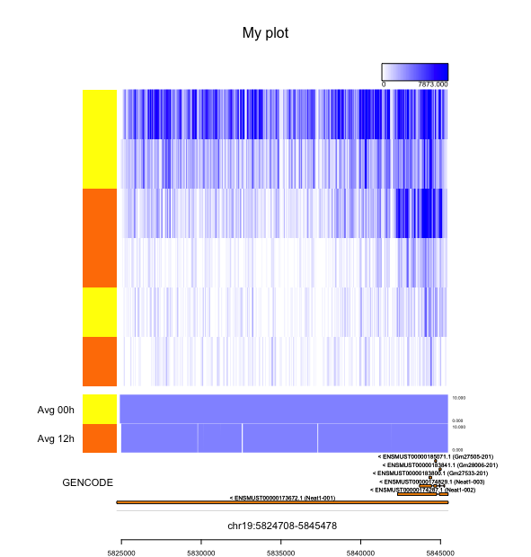
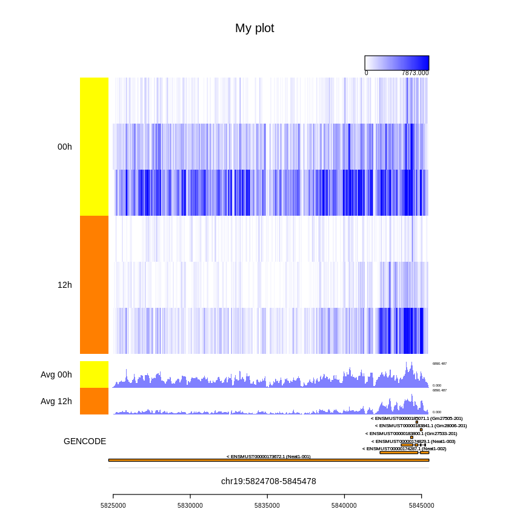

# Tutorial for Millefy

This tutorial consists of the following sections:

1. Preparing input data
    - 1-1. Converting BAM to BigWig files using deepTools
    - 1-2. Converting BAM to BigWig files using deepTools while separating read coverage on forward and reverse strand in strand-specific (sc)RNA-seq data
2. Using Millefy
    - 2-1. Preparing Tracks
    - 2-2. Generating Millefy plots
3. Saving Millefy plots


## 1. Preparing input data

### 1-1. Converting BAM to BigWig files using deepTools

[deepTools](https://deeptools.readthedocs.io) is a useful toolkit to convert and process BAM files.

The `bamCoverage` command of deepTools can be used to convert BAM and BigWig. See [the manual of deepTools](https://deeptools.readthedocs.io/en/develop/content/tools/bamCoverage.html) for details on the options.

```
bamCoverage -b [BAM file] -o [BigWig file] -of bigwig --binSize 1 --smoothLength 1 --numberOfProcessors 1
```

### 1-2. Converting BAM to BigWig files using deepTools while separating read coverage on forward and reverse strand in strand-specific (sc)RNA-seq data

If your data is derived from strand-specific (sc)RNA-seq experiments and you want to visualize read coverage 

The below is the example when your strand-specific (sc)RNA-seq experiments is where R1 reads are derived from antisense and R2 reads are derived from sense strand of RNAs.

First, we separate reads derived from the forward strand and reverse strand in a BAM file into two BAM files. Specifically, 

- for the read coverage of the forward (Watson) strand, we select R1 reads on the reverse strand and R2 reads on the forward strand.
- for the read coverage of the reverse (Crick) strand, we select R1 reads on the forward strand and R2 reads on the reverse strand.

For this task, we use both [bamtools](https://github.com/pezmaster31/bamtools), a toolkit for working with BAM files, and [samtools](http://www.htslib.org) in this tutorial, but there are another ways to do the same task. You can download the scripts for bamtools from [https://github.com/yuifu/millefy/tree/master/tutorial](https://github.com/yuifu/millefy/tree/master/tutorial).

Then, we convert each of two BAM files to the corresponding BigWig file using deepTools.

```
forward_bam=f.bam # Your favorite filename
reverse_bam=r.bam # Your favorite filename
obwf=f.bw         # Your favorite filename
obwr=r.bw         # Your favorite filename

bamtools filter -in $ibam -out $forward_bam -script bamtools_f.json
samtools index $forward_bam

bamtools filter -in $ibam -out $reverse_bam -script bamtools_r.json
samtools index $reverse_bam

bamCoverage -b $forward_bam -o $obwf -of bigwig --binSize 1 --smoothLength 1 --numberOfProcessors 1
bamCoverage -b $reverse_bam -o $obwr -of bigwig --binSize 1 --smoothLength 1 --numberOfProcessors 1
```


## 2. Using Millefy
### 2-1. Preparing Tracks

Next, we want to prepare different types of tracks:

1. scRNA-seq tracks, which display scRNA-seq read coverage as a heat map with ordered cells
    - Input file format: BAM, BigWig
2. Mean scRNA-seq read coverage tracks,
    - Note: This track is automatically generated by a scRNA-seq track).
3. Bulk NGS data tracks, which display read coverage of other NGS data
    - Input file format: BAM
4. BED tracks, which display genomic intervals defined by BED files
    - Input file format: BED
5. Gene annotation tracks
    - Input file format: GTF

Using these tracks, Millefy can simultaneously display read coverage of each cell and mean read coverage of cells in each user-defined cell group as well as align scRNA-seq data with genome annotation data and NGS data. % simultaneously


#### Single cell track
```
# Path to bigWig files
bwfiles = c("bw1.bw", "bw2.bw", "bw3.bw", "bw4.bw", "bw5.bw")

# Group labels for bigWig files (same length as \\code{bwfiles})
groups = c("A", "A", "A", "B", "B")

# Color labels for bigWig files (A named vector with the same length as the number of kinds of \\code{groups})
color_labels <- colorRampPalette(c("yellow", "red"))(length(unique(groups))+1)[1:length(unique(groups))]
names(color_labels)  <- unique(groups)

# Parameters
max_value = 7873

# Defining single cell track
scTrackBw <- list(path_bam_files = bwfiles, groups = groups, group_colors = color_labels, max_value = max_value, isBw=TRUE)
```

#### Bulk NGS data trak

```
# Path to bigWig files
bamfiles_bulk = c("bulk1.bw", "bulk2.bw", "bulk3.bw")

# Group labels for BAM files (same length as \\code{bamfiles})
groups_bulk = c("A", "A", "B")

# Color labels for bigWig files (A named vector with the same length as the number of kinds of \\code{groups})
color_labels_bulk <- colorRampPalette(c("yellow", "red"))(length(unique(groups))+1)[1:length(unique(groups))]
names(color_labels_bulk)  <- unique(groups_bulk)

# Calculating normalization factors
nf_bulk = calcBamNormFactors(bamfiles_bulk)

# Defining single cell track
bulkTrack1 <- list(path_bam_files = bamfiles_bulk, normFactor = nf_bulk, groups = groups_bulk, 
                  trackHeight = 1, log=FALSE, color_labels = color_labels_bulk)
```

#### BED track

```
# Defining path to a BED file (For faster performance, try to use \\code{dt_bed} paramter)
path_bed = "mECS_enhancers.bed"

# Loading information in GTF onto a `data.table` object
dt_bed = fread(path_bed, header=FALSE)

# Defining BED track
bedTrack1 <- list(path_bed= path_bed, dt_bed = dt_bed, label = "mECS enhancers")
```

#### Gene annotation track

```
# Define path to a GTF file (For faster performance, try to use \\code{dt_gtf} paramter)
path_gtf = "annotation/gencode.gtf"

# Loading information in GTF onto a `data.table` object
dt_gtf_exon <- gtfToDtExon(path_gtf)

# Defining gene track
geneTrack1 <- list(path_gtf = path_gtf, dt_gtf = dt_gtf_exon, label = "GENCODE")
```


### 2-2. Generating Millefy plots

```
# Prepare arguments for \\code{millefyPlot()}
tdlist <- list(scTrackBw, bulkTrack1, bedTrack1, geneTrack1)

# Defining track properties
tt <- c("sc", "add", "bed" "gene")

# Defining relative heights of tracks
heights = c(12, 3, 1, 2)

# Defining title text on Millefy plots
text_main = "My plot"

# Defining location to visualize
chr =  "chr19" # character
start = 5824708 # integer
end = 5845478 # integer


```

```
# Plot
l <- millefyPlot(track_data=tdlist, track_type=tt, heights=heights,
          sc_type = "heatmap",
          chr = chr, start = start, end = end,
          sc_avg = TRUE, sc_avg_height = 1,
          title = text_main)
```



```
# Replot
invisible(
  millefyPlot(
        track_data=l$track_data, track_type=l$track_type, heights=l$heights,
        sc_type = "heatmap",
        chr = chr, start = start, end = end,
        sc_avg = TRUE, sc_avg_height = 1,
        title = text_main, sc_avg_scale = 10, sc_sort_destiny = 'all'
        )
)
```




```
# Replot
invisible(
  millefyPlot(
        track_data=l$track_data, track_type=l$track_type, heights=l$heights,
        sc_type = "heatmap",
        chr = chr, start = start, end = end,
        sc_avg = TRUE, sc_avg_height = 1,
        title = text_main,
        sc_avg_scale = 10, sc_sort_destiny = 'group'
        )
)
```



### 3. Saving Millefy plots

By putting `millefyPlot()` between `pdf()` and `dev.off()`, you can save the plot to a PDF file

```
# Save plots to a PDF file
pdf("millefy_plot.pdf")
invisible(
  millefyPlot(
        track_data=l$track_data, track_type=l$track_type, heights=l$heights,
        sc_type = "heatmap",
        chr = chr, start = start, end = end,
        sc_avg = TRUE, sc_avg_height = 1,
        title = text_main,
        sc_avg_scale = 10, sc_sort_destiny = 'group'
        )
)
dev.off()
```

You can save the different versions of Millefy plot in a single PDF file.

```
# Save plots to a PDF file
pdf("millefy_plot_2.pdf")
invisible(
  millefyPlot(
        track_data=l$track_data, track_type=l$track_type, heights=l$heights,
        sc_type = "heatmap",
        chr = chr, start = start, end = end,
        sc_avg = TRUE, sc_avg_height = 1,
        title = text_main,
        sc_avg_scale = 10, sc_sort_destiny = 'group'
        )
)

invisible(
  millefyPlot(
        track_data=l$track_data, track_type=l$track_type, heights=l$heights,
        sc_type = "heatmap",
        chr = chr, start = start, end = end,
        sc_avg = TRUE, sc_avg_height = 1,
        title = text_main,
        sc_avg_scale = 10, sc_sort_destiny = 'group'
        )
)
dev.off()
```

You can also repeat generating Millefy plot for multiple loci of your interest and save them to separate files.

```
# Define loci of your interest
df_loci = data.frame(
  chr = c("chr1", "chr2", "chr3"),
  start = c(121414, 500000, 600000),
  end = c(122414, 502000, 602000),
  label = c("locus1", "locus2", "locus3")
  )

# Interate over the defined loci
for(i in 1:nrow(df_loci)){

    # Define a locus
    chr = df_loci[i,]$chr
    start = df_loci[i,]$start
    end = df_loci[i,]$end
    label = df_loci[i,]$label

    # Save plots to a PDF file
    paste0("millefy_plot_", label, ".pdf")
    pdf("millefy_plot.pdf")
    invisible(
      millefyPlot(
            track_data=l$track_data, track_type=l$track_type, heights=l$heights,
            sc_type = "heatmap",
            chr = chr, start = start, end = end,
            sc_avg = TRUE, sc_avg_height = 1,
            title = text_main,
            sc_avg_scale = 10, sc_sort_destiny = 'group'
            )
    )
    dev.off()
}
```

